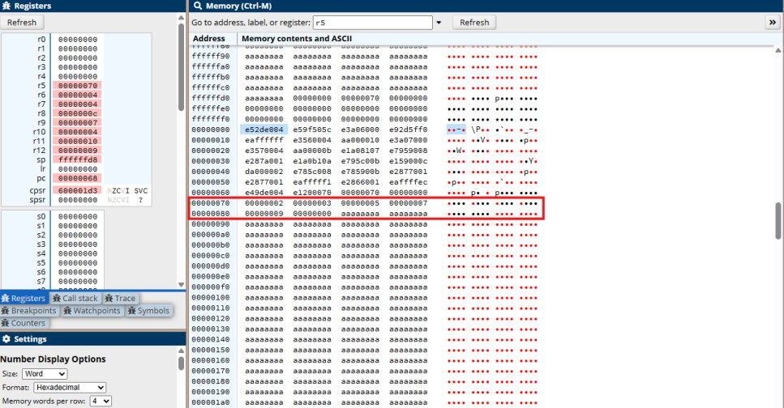

# bubbleSort-Alghorithm-in-ARM-Assembly
## How the code works:
The code starts to work with .data section. In this section, it is defined an array of integers contains 
7,3,5,2,9. After that it goes to .text, where the code part written. First the main function, _start, it 
pushes link register onto stack, it’s purpose is to preserve return adress. Then, array’s adress, loads to 
R5. Then for the first for loop, which it's defined as “outer_for loop”, it's defined i, as R6 initialized by 0. 
Then the code exits the _start function and enters bubbleSort function. Firstly the code save R4,R5,…,R12 
and LR to stack to preserve callee-saved registers. Then it enters first for loop, “outer_for_loop”. In 
outer_for_loop, first it compares R6 with size, which is 4. If R6 greater or equal than 4, it goes to end 
function. In end function, the code get Link Register then finish the alghorithm with “bkpt” as known as 
“breakpoint”. If R6 is less than 4, it continues the function. It is defined R7, which is the second for loop’s 
j initialized by 0, after that enters the second for loop, defined as “inner_for_loop”. In this function, 
first it compares R7=j, and 4. If greater or equal than, it goes to “outer_for_continue”. This part’s 
purpose is it will work if “inner_for_loop” finished and going back to “outer_for_loop”. It adds i to 1, 
and goes back to “outer_for_loop” function. Continuing to “inner_for_loop”, R8 is j*4. In arm 
assembly, data moves by bytes, and every adjacent component, it has 4 bytes. To find the byte, we 
use 2^n. So in “LSL R8, R7, #2” we say logical shift left, R7*(2^2) =R8, this calculates the byte offset. 
Then load R5’s R8th value into R9’s memory, it equals to array[j]. Then it adds j to 1, and defined it in 
R10. Then it does the same thing to contain array[j+1], and defined as R12. Then it compares R9 and 
R12, if greater than, it continues the code. In the continued code, it swaps R12 and R9. Then adds r7 
to 1. If less or equal to and when the “inner_for_loop” finished, it goes to “no_swap” function. In this 
function, it adds r7 to 1, and goes back to “inner_for_loop”. 

## Registers:
R5: Array’s adress.
R6: First for loop, outer_for_loop’s index, i.
R7: Second for loop, inner_for_loop’s index, j.
R8: Byte offset for j
R9: array[j]
R10: j+1
R11: Byte offset for j+1
R12: array[j+1]

## Stack Behaviour:
At _start, Link Register is saved by PUSH {LR}. Then in bubbleSort, R4-R12 and LR are saved with PUSH 
{R4-R12, LR}. At end, Link Register is restored.

## Data Movement:
Byte addressing is used with LSL to compute the correct memory offsets. LDR and STR are used to 
read and write array values in memory

## Branching:
BGE, BLE, and unconditional B instructions control loop flow. Inner and outer loops are managed via 
conditional branching and jump labels

## Run code:
